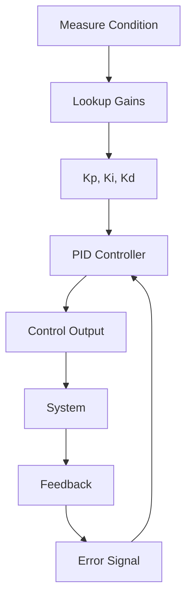

# Adaptive PID with Dynamic Coefficients Example

This example demonstrates adaptive PID control using interpolating lookup tables to dynamically adjust controller gains based on operating conditions or error magnitude.

## What This Example Shows

- Dynamic PID gain adjustment based on error or conditions
- Using lookup tables to map conditions to controller gains
- Adaptive control that improves performance across operating range
- Gravity compensation lookup for robotic systems
- Non-linear controller tuning
- Smooth gain transitions without discontinuity

## Running the Example

```bash
cd interplut/examples/adaptive_pid
go run main.go
```

## Key Learning Points

### Adaptive Control Principles

The example demonstrates:

- **Fixed Gains Limitation**: Single PID gains can't be optimal everywhere
- **Adaptive Gains**: Adjust Kp, Ki, Kd based on system state
- **Smooth Transitions**: Interpolation prevents gain jumps
- **Robustness**: Better performance across wider operating range
- **Load Compensation**: Handle varying load conditions

### Adaptation Strategies

Different approaches to gain adaptation:

1. **Error-Based**: Larger errors use more aggressive gains
2. **Load-Based**: Heavy loads use different gains than light loads
3. **State-Based**: Gains depend on current position or velocity
4. **Condition-Based**: Thermal, wear, or environmental factors

## Output Interpretation

The example displays:

- **Error or Condition**: Input variable for gain lookup
- **Kp, Ki, Kd**: Current controller gains
- **Reference**: Setpoint or target
- **Actual**: Current system state
- **Output**: Control signal from adaptive PID

## System Parameters

The example typically uses:

- **Condition Range**: Minimum to maximum values for adaptation variable
- **Gain Curves**: How Kp, Ki, Kd vary across condition range
- **Breakpoints**: Discrete conditions defining gain table

## Further Exploration

Try modifying:

- Gain table values - See effects on response
- Adaptation variable - Test error vs. load vs. state
- System dynamics - Different time constants
- Trajectory - Step response vs. ramp vs. sinusoid
- Add more breakpoints - Improve resolution

## Real-World Applications

Adaptive control is essential in:

- **Robotic Arms**: Gravity compensation changes with configuration
- **Vehicle Suspension**: Stiffness adaptation for road conditions
- **Flight Control**: Gain scheduling for different airspeeds
- **Process Control**: Adaptation to load or environmental changes
- **Motor Control**: Speed-dependent tuning
- **Thermal Systems**: Temperature-dependent response
- **Manufacturing**: Product-dependent compensation
- **Medical Devices**: Patient-specific adaptation

## Comparison: Fixed vs. Adaptive Gains

| Condition | Fixed Gains | Adaptive Gains |
|-----------|------------|----------------|
| Light Load | Overshoot | Good Response |
| Heavy Load | Sluggish | Good Response |
| Small Error | Aggressive | Appropriate |
| Large Error | Oscillates | Appropriate |
| Wide Range | Compromise | Optimized |

## Adaptation Approaches

### Error-Magnitude Adaptation

Scale gains proportionally to error size:

- Small errors: Conservative gains (prevent overshoot)
- Large errors: Aggressive gains (fast response)
- Formula: $K = K_0 \cdot (1 + \alpha \cdot e^2)$

### Load Adaptation

Different gains for different payload masses:

``` code
      Kp ↑
         |     Light Load
         |    ╱╲
         |   ╱  ╲_____ Heavy Load
         |__╱
         └────────────── Load →
```

### Position-Based Adaptation

Gravity compensation varies with arm configuration:

- Horizontal: Minimal gravity effect
- Vertical: Maximum gravity effect
- Diagonal: Intermediate effect

## Implementation Considerations

- **Condition Measurement**: Need reliable signal for adaptation variable
- **Table Validation**: Ensure gains stay within safe limits
- **Transition Smoothness**: Interpolation prevents gain jumps
- **Feedback Control**: Always use feedback, not just adaptation
- **Safety Limits**: Constrain gains to reasonable ranges

## Control Loop with Adaptive Gains



## Gain Scheduling Theory

Classic gain scheduling uses state-based adaptation:

- Compute or measure current state
- Look up appropriate gains
- Apply PID with those gains
- Repeat at each control cycle

This approach is used in:

- Aircraft autopilots (varying airspeed)
- Industrial processes (varying load)
- Robotics (varying arm configuration)
- Automotive (varying speed and conditions)

## Creating Adaptation Tables

### Experimental Approach

1. **Identify Variable**: What should trigger adaptation?
2. **Sample Range**: Test across entire operating range
3. **Tune Gains**: Optimize Kp, Ki, Kd at each point
4. **Record Values**: Create lookup table from results
5. **Validate**: Test interpolated gains in real system

### Analytical Approach

- **Model-Based**: Use system model to predict optimal gains
- **Theory**: Pole placement or LQR optimization
- **Simulation**: Verify in simulation before hardware test

## Performance Expectations

Well-designed adaptive control achieves:

- Consistent response across operating range
- Minimal overshoot in all conditions
- Fast convergence regardless of load
- Smooth gain transitions
- Robust to disturbances

## Common Challenges

**Slow Adaptation**: If gains change slowly, may miss transients
**Noisy Condition Signal**: Noise in measurement variable causes gain chatter
**Discontinuity**: Poorly chosen breakpoints create control jumps
**Oversensitivity**: Too aggressive adaptation causes oscillation
**Model-Reality Gap**: Simulation differs from actual system

## Advanced Techniques

- **Multi-Dimensional Tables**: Adapt based on multiple variables
- **Nonlinear Interpolation**: Non-uniform point spacing
- **Learning Adaptation**: Automatically optimize gains
- **Cascade Adaptation**: Different adaptation levels
- **Robust Scheduling**: Guarantees stability across all conditions

## Safety Considerations

- **Bound Checking**: Ensure gains stay in safe range
- **Rate Limiting**: Prevent abrupt gain changes
- **Validation**: Monitor for unreasonable outputs
- **Fallback**: Default to conservative gains if condition signal fails
- **Logging**: Record adaptation decisions for analysis

## Validation Checklist

- [ ] Adaptation variable measured reliably
- [ ] Lookup table created across full range
- [ ] Interpolated gains are smooth
- [ ] No gain discontinuities at breakpoints
- [ ] Safety bounds enforced
- [ ] Real system response acceptable
- [ ] Stable across all adaptation points
- [ ] No unexpected oscillations
