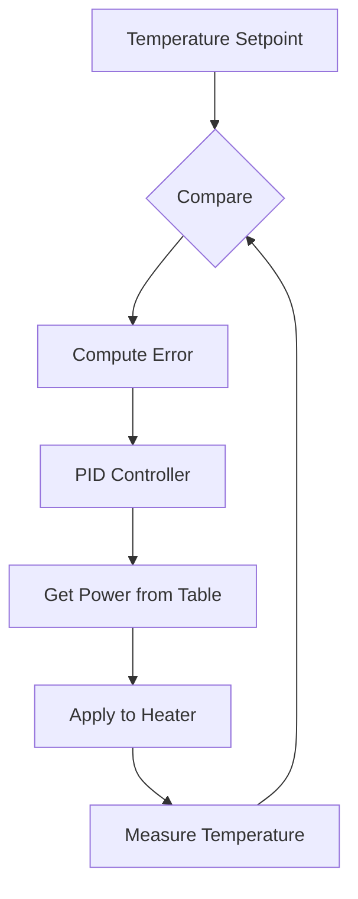

# Non-Linear Temperature Control Example

This example demonstrates using interpolating lookup tables to handle non-linear temperature control systems where heater power doesn't have a linear relationship to temperature.

## What This Example Shows

- Non-linear system characterization through lookup tables
- Creating temperature control mappings from experimental data
- Handling systems where control input doesn't scale linearly
- Improving control accuracy through interpolated tables
- Practical thermal system control
- Comparison with linear vs. non-linear approaches

## Running the Example

```bash
cd interplut/examples/temperature
go run main.go
```

## Key Learning Points

### Non-Linear Systems

The example demonstrates:

- **Linear Assumption Fails**: Many systems don't behave linearly
- **Lookup Tables**: Map measured behaviors instead of assuming linear
- **Characterization**: Experimentally determine input-output relationships
- **Interpolation**: Fill in unmeasured points smoothly
- **Improved Control**: Non-linear compensation improves accuracy

### Temperature Control Non-Linearities

Real thermal systems exhibit:

- **Deadband**: Heater must exceed threshold before heating begins
- **Saturation**: Maximum heating power limit
- **Variable Efficiency**: Heat transfer changes with temperature difference
- **Time Constant**: Varies with power level or temperature
- **Hysteresis**: Heating and cooling rates differ

## Output Interpretation

The example displays:

- **Power Setting**: Heater power (0-100%)
- **Temperature**: Resulting system temperature
- **Expected vs. Actual**: Comparison of linear model vs. real system
- **Error**: Difference between predicted and actual

## System Parameters

The example typically uses:

- **Calibration Points**: Temperature measurements at various power levels
- **Temperature Range**: Minimum to maximum controllable temperatures
- **Power Range**: 0-100% heater output

## Further Exploration

Try modifying:

- Add calibration points - Improve table accuracy
- Change power values - See non-linear effects
- Test interpolated points - Verify smooth transitions
- Compare linear vs. interpolated - Observe improvement
- Simulate different systems - Heating coil vs. resistive element

## Real-World Applications

Non-linear control is essential for:

- **Reflow Ovens**: Electronic circuit board soldering
- **Laboratory Furnaces**: Material processing
- **Incubators**: Temperature-sensitive applications
- **Hot Plate Control**: Lab heating equipment
- **Reactor Temperature**: Chemical processing
- **Cryogenic Systems**: Temperature reduction
- **Thermal Chambers**: Environmental testing
- **Water Heaters**: Home temperature control
- **Sterilizers**: Medical equipment

## Comparison: Linear vs. Non-Linear

| Aspect | Linear Model | Lookup Table |
|--------|--------------|--------------|
| Tuning | Simple | Requires calibration |
| Accuracy | Moderate | High across range |
| Robustness | Breaks near limits | Inherently robust |
| Computation | Instant | Microsecond lookup |
| Adaptation | Fixed gains | Can be updated |
| Complexity | Very low | Low-moderate |

## Creating Calibration Tables

### Experimental Procedure

1. **Reset System**: Bring to room temperature
2. **Record Baseline**: Note initial temperature
3. **Apply Known Power**: Set heater to 10%, wait for steady state
4. **Record Temperature**: Note final temperature
5. **Increase Power**: Move to 20%, repeat
6. **Continue**: Cover entire 0-100% range
7. **Plot Data**: Visualize the relationship

### Data Processing

- Smooth noisy measurements (averaging)
- Identify deadbands and saturation
- Check for hysteresis
- Fill gaps with interpolation
- Validate results

## Implementation Considerations

- **Calibration Drift**: Recalibrate periodically as system ages
- **Load Variations**: Different loads may need different tables
- **Safety Limits**: Prevent excessive temperatures
- **Feedback**: Always use temperature feedback, not just open-loop tables
- **Error Handling**: Graceful degradation if sensor fails

## Deadband Compensation

Many thermal systems have deadbands:

``` code
      Temperature Increase
      ↑ 
      |     ╱
      |    ╱
      |___╱  ← Deadband
      |
      └────────── Power →
        0% 20% 40%
```

The lookup table naturally captures this behavior.

## Control Loop with Interpolation



## Performance Expectations

Non-linear temperature control achieves:

- Faster convergence (correct compensation from start)
- Less overshoot (no need for conservative gains)
- Better steady-state accuracy
- Wider effective operating range
- More robust to load changes

## Common Challenges

**Sparse Calibration**: Too few points create interpolation errors
**Noisy Sensors**: Sensor noise creates irregular tables
**Slow Systems**: Temperature lag makes steady-state hard to define
**Hysteresis**: Heating and cooling behave differently
**Load Sensitivity**: Different loads require different tables

## Advanced Techniques

- **2D Tables**: Map temperature and load to power
- **Adaptive Tables**: Update based on observed behavior
- **Feedback Fusion**: Combine feedforward table with feedback
- **Model-Based**: Start with physics model, refine with data
- **Learning Control**: Neural networks learn optimal maps

## Safety Considerations

- **Over-Temperature Limits**: Hard limit on maximum safe temperature
- **Ramp Rate Limits**: Prevent thermal shock
- **Timeout Protection**: Turn off heater if temperature doesn't change
- **Sensor Validation**: Detect failed temperature sensors
- **Emergency Cooling**: Method to cool system if needed

## Validation Checklist

- [ ] Calibration completed across full range
- [ ] No missing or erratic data points
- [ ] Interpolated values are smooth
- [ ] Edge cases handled (0%, 100%)
- [ ] Feedback control active
- [ ] Safety limits enforced
- [ ] Performance acceptable across conditions
