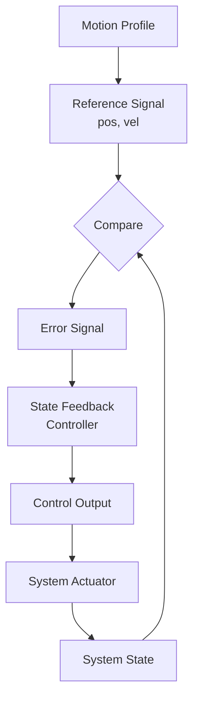

# Motion Profile with Full-State Feedback Control Example

This example demonstrates how to integrate motion profiles with state feedback control for precise trajectory tracking with multiple state variables.

## What This Example Shows

- Generating motion profiles (trapezoidal or triangle)
- Using profiles as reference for position, velocity, and acceleration
- Multi-state feedback control (position, velocity, acceleration)
- Tracking profiles with state feedback
- Comparison of profile-following performance
- Integration of motion planning with state control

## Running the Example

```bash
cd motionprofile/examples/fullstate_control
go run main.go
```

## Key Learning Points

### Motion Profile + State Feedback Integration

The example demonstrates:

- **Reference Generation**: Profiles provide position and velocity setpoints
- **State Tracking**: Feedback control follows the reference trajectory
- **Smooth Motion**: Combination produces smooth, predictable movement
- **Error Correction**: Feedback handles model errors and disturbances
- **Multi-Axis**: Can be extended to multiple coordinated axes

### Control Architecture

1. Generate reference trajectory from motion profile
2. Measure or estimate system state
3. Compare state to profile reference
4. Compute control input using state feedback
5. Apply to system and repeat

## Output Interpretation

The example displays:

- **Profile Time**: Current time in the motion profile
- **Reference Position**: Target position from profile
- **Reference Velocity**: Target velocity from profile
- **Actual Position**: Current system position
- **Actual Velocity**: Current system velocity
- **Tracking Error**: Difference between reference and actual
- **Control Signal**: Output of state feedback controller

## System Parameters

The example typically uses:

- **Motion Profile**: Trapezoidal or triangle type
- **Profile Duration**: Total time for motion
- **System Dynamics**: Model parameters
- **Feedback Gains**: State feedback controller gains
- **Sample Time**: Control loop update rate

## Further Exploration

Try modifying:

- Profile parameters (max velocity, acceleration)
- State feedback gains
- System dynamics
- Initial conditions
- Reference trajectory patterns

## Real-World Applications

This technique is used in:

- **CNC Machine Tools**: Multi-axis coordinated motion
- **Robotic Systems**: Smooth trajectory execution
- **Manufacturing Equipment**: Precise positioning
- **Automated Guided Vehicles**: Path following
- **Flight Control**: Trajectory tracking
- **Mechanical Automation**: Complex motion sequences
- **Precision Assembly**: Component positioning

## Related Examples

- `../basic/` - Motion profile fundamentals
- `../triangle/` - Alternative triangle profile
- `../../feedback/examples/feedback_control/` - State feedback basics
- `../../pid/examples/` - Alternative feedback approach
- `../../feedforward/examples/` - Combining feedforward with profiles

## Control Architecture Diagram



## Performance Expectations

Well-designed profile tracking should achieve:

- Zero steady-state error (profile following)
- Minimal overshoot (< 5%)
- Fast settling to reference trajectory
- Smooth control signals
- Stable operation across profile shapes

## Advanced Concepts

- **Time-Optimal Control**: Generating profiles that minimize time
- **Constrained Trajectories**: Respecting workspace limits
- **Multi-Axis Synchronization**: Coordinating multiple motors
- **Adaptive Trajectories**: Changing profiles based on conditions
- **Robustness**: Handling model uncertainties

## Tuning Approach

1. **Generate Profile**: Start with basic trapezoidal motion
2. **Select Gains**: Use pole placement or LQR theory
3. **Test Tracking**: Verify error magnitude
4. **Adjust Gains**: Increase for faster response or decrease for stability
5. **Validate**: Test across different motions

## Comparison: Different Control Approaches

| Approach | Simplicity | Accuracy | Robustness |
|----------|-----------|----------|-----------|
| Profile Only | Very High | Low | Low |
| PID Feedback | High | Moderate | Good |
| State Feedback | Moderate | High | Good |
| Profile + Feedback | Moderate | High | Very Good |

## Implementation Checklis

- [ ] Motion profile generation working
- [ ] State measurement or estimation available
- [ ] Feedback gains calculated
- [ ] Control loop running at consistent rate
- [ ] Tracking error acceptable
- [ ] No overshooting or oscillation
- [ ] Stable across different motions
